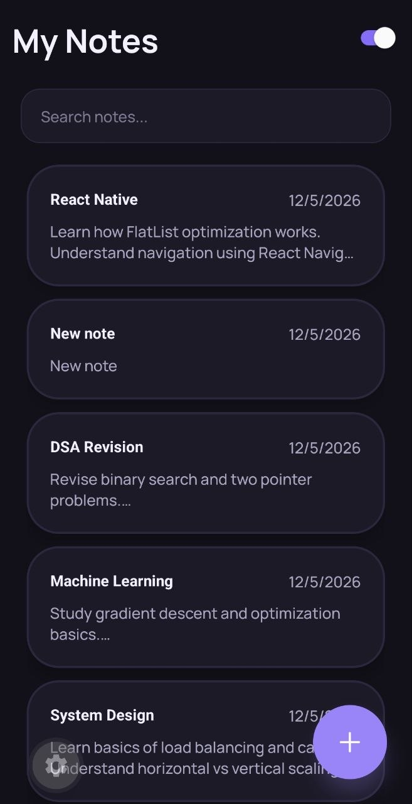
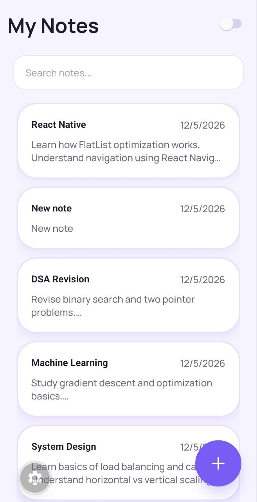
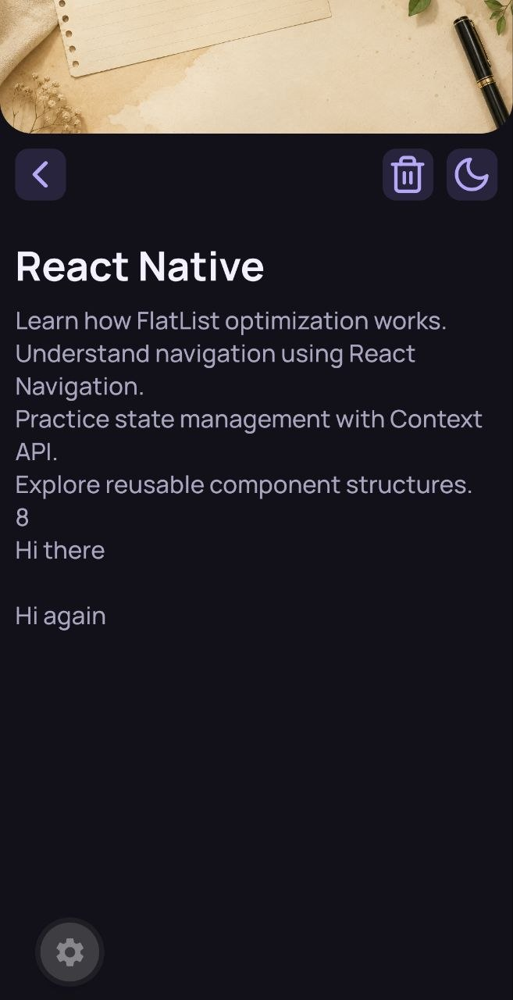
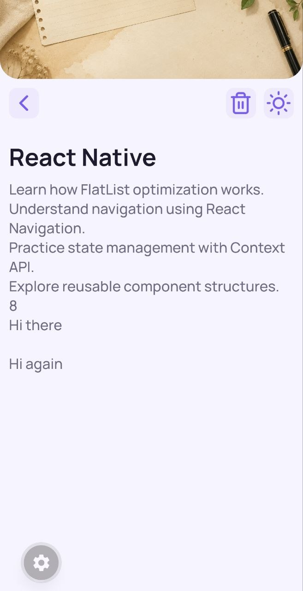
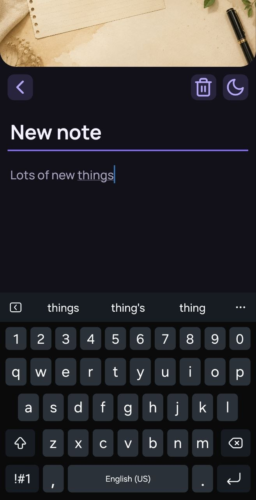
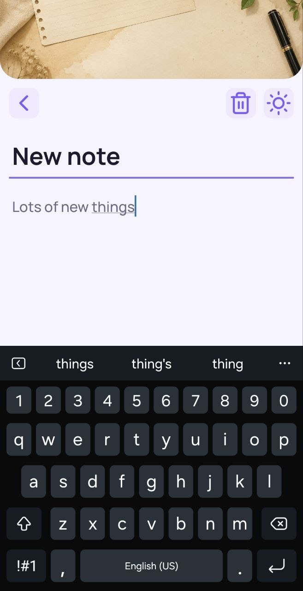
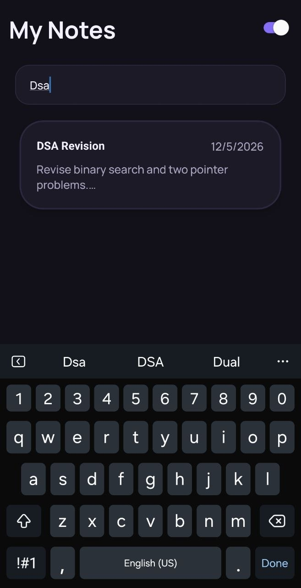
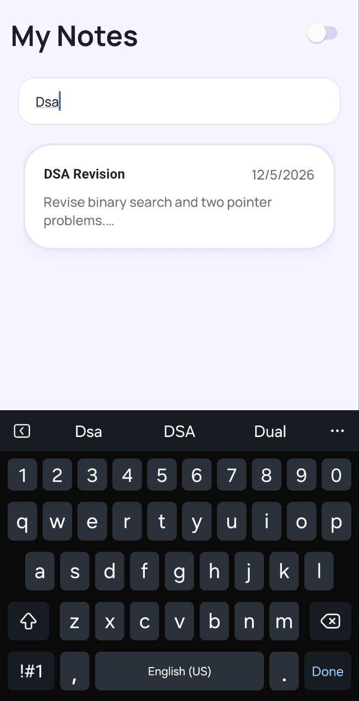

# 📝 Notes App 

A modern and responsive Notes App built using React Native and Expo.

This project focuses on:

* UI implementation
* state management without navigation libraries
* responsive layouts
* dynamic theming
* clean component architecture

The app contains two main views:

* View 1 → Notes listing screen
* View 2 → Notes editor screen

https://github.com/user-attachments/assets/08d4f60e-e277-44b0-b134-6c8590863c0a
---

# ✨ Features

## 📋 View 1 – Notes Listing Screen

* Display all notes using `FlatList`
* Beautiful note cards with:

  * title
  * content preview
  * date
* Search notes by title/content
* Floating Action Button (FAB) to create notes
* Dynamic dark/light theme toggle
* Responsive UI for phones and tablets

---

## ✍️ View 2 – Notes Editor Screen

* Editable note title
* Editable multiline note content
* Auto-save while editing
* Create new notes
* Delete notes
* Keyboard-aware scrolling
* Elegant header background image
* Back button to return to View 1

---

# 🎨 UI Enhancements

* Modern minimal design
* Manrope custom font integration
* Dynamic theme system
* Soft shadows and elevation effects
* Rounded card layouts
* Responsive spacing and typography
* Elegant floating action button
* Tablet-friendly layouts

---

# 🛠️ Tech Stack

| Technology                              | Purpose                 |
| --------------------------------------- | ----------------------- |
| React Native                            | Mobile app development  |
| Expo                                    | Development environment |
| Expo Router                             | Project structure       |
| JavaScript / TypeScript                 | App logic               |
| react-native-keyboard-aware-scroll-view | Keyboard handling       |
| Expo Vector Icons                       | Icons                   |

---

# 🧩 Components Used

## Screens

* `View1`
* `View2`

## Custom Components

* `Header`
* `SubHeader`
* `Card`
* `Notes`
* `FloatingActionButton`

## React Native Components

* `View`
* `Text`
* `FlatList`
* `Pressable`
* `TextInput`
* `ImageBackground`
* `Switch`
* `SafeAreaView`
* `StatusBar`
* `KeyboardAwareScrollView`

---

# ⚛️ Hooks Used

## React Hooks

* `useState`
* `useEffect`

## React Native Hooks

* `useColorScheme`
* `useWindowDimensions`

---

# 📱 Responsive Design

The app is fully responsive and adapts to:

* Mobile devices
* Tablets
* Different screen sizes
* Dark/light system themes

Responsive behavior implemented using:

* `useWindowDimensions`
* percentage-based sizing
* dynamic font scaling
* conditional tablet layouts

---

# 🌙 Theme System

The app uses a centralized theme configuration with:

* Light theme
* Dark theme
* Dynamic colors
* Icon themes
* Card/background variations

Theme switching is handled in real time.

---

# 📂 Project Structure

```bash
src/
 ├── app/
 │    └── index.tsx
 │
 ├── components/
 │    ├── Card.tsx
 │    ├── FloatingActionButton.tsx
 │    ├── Header.tsx
 │    ├── Notes.tsx
 │    └── SubHeader.tsx
 │
 ├── constants/
 │    ├── notes.ts
 │    └── theme.ts
 │
 └── screens/
      ├── View1.tsx
      └── View2.tsx
```

---

# 🚀 Getting Started

## 1. Clone Repository

```bash
git clone [<your-repository-link>](https://github.com/GauravJain001/Notes-App/)
```

---

## 2. Install Dependencies

```bash
npm install
```

---

## 3. Start Expo Server

```bash
npx expo start
```


---

# 🔗 GitHub Repository

Add your repository link here:

```text
<github-repository-link>
```

---

# 📸 Screenshots
<p float="left">
  
  
  
</p>
<p float="left">
  
  
  
</p>
<p float="left">
  
  
</p>


---

# Requirements Covered

✅ Notes displayed using FlatList
✅ Search functionality
✅ Dynamic dark/light mode
✅ Pressable note cards
✅ Multiline note editing
✅ Keyboard handling
✅ Image background
✅ Responsive layout
✅ Styles via `StyleSheet.create()`
✅ Usage of `StyleSheet.compose()` and `StyleSheet.flatten()`

---

